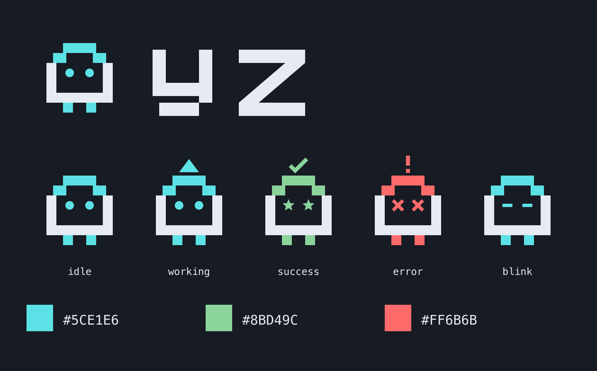

# yz brand assets

Vector artwork derived from `internal/ui/mascot.go`, using the accent colors in `internal/ui/styles.go`. The block silhouette, two eyes, little feet, and status expressions carry over from the terminal. These assets are a graphic adaptation, not a screenshot of terminal glyphs.



## Choose an asset

| Use | SVG | PNG |
| --- | --- | --- |
| Transparent mascot on dark backgrounds | `mascot.svg` | `mascot-{256,512,1024}.png` |
| Transparent mascot on light backgrounds | `mascot-light.svg` | `mascot-light-{256,512,1024}.png` |
| Single-color artwork | `mascot-mono.svg`, `mascot-white.svg` | 256, 512, 1024 px |
| Logo on dark backgrounds | `logo-dark.svg` | `logo-dark-{736,1472}.png` |
| Logo on light backgrounds | `logo-light.svg` | `logo-light-{736,1472}.png` |
| Single-color logo | `logo-mono.svg` | `logo-mono-{736,1472}.png` |
| App / repository avatar | `icon.svg`, `icon-light.svg` | 32, 64, 128, 256, 512, 1024 px |
| Browser favicon | `favicon.svg`, `favicon.ico` | 16, 32, 48 px |
| Apple touch icon | — | `apple-touch-icon.png` (180 px) |
| Android / PWA icons | `icon.svg` | `android-chrome-192x192.png`, `android-chrome-512x512.png` |
| Working, success, error, blinking | `mascot-{working,success,error,blink}.svg` | 256, 512, 1024 px |
| Social / link preview | `social-card.svg` | `social-card-1200x630.png` |

Logo names indicate their intended background; logo and mascot files are transparent. App icons and the social card include their backgrounds. The favicon ICO contains 16, 32, and 48 px frames.

## Palette and use

- Cyan: `#5CE1E6` — default and working.
- Green: `#8BD49C` — success.
- Red: `#FF6B6B` — error.
- Pale body: `#E6EAF2`; dark body: `#242B38`.
- Icon background: `#171B23`; light icon background: `#F3F5F8`.

Keep the proportions and a clear margin around the artwork. Use a square icon at small sizes, where the wordmark is unnecessary. Prefer the monochrome variant for single-color printing. The logo wordmark uses vector paths and needs no font. Preview-card captions use a generic monospace font.

## Regenerate

From the repository root, with Python 3 and `rsvg-convert` (librsvg) installed:

```sh
python3 assets/brand/generate.py
```

The SVGs are the editable source; PNG and ICO files are exports. No AI image-generation service or credentials are needed.
